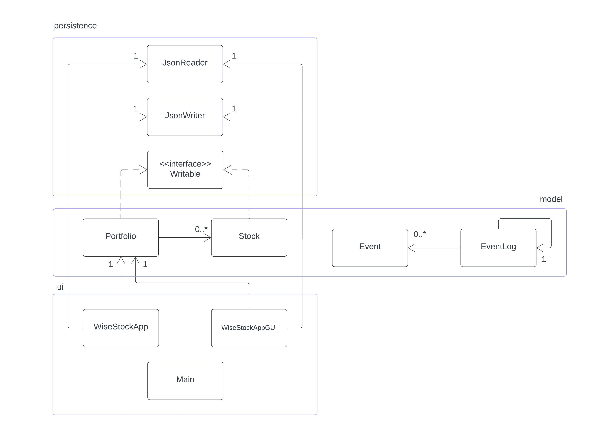

# WiseStocks - Stock Portfolio Management and Analyzer

## What is WiseStocks?

    

WiseStocks is a stock analyzer app helping stock investor making decision on analyzing the fundamental of stocks. 

## Who is WiseStocks for?
WiseStocks audience are stock investors and stock traders.

    
    

## Why?
This project is interesting to me because of my interest in stock market. As an investor, I would like 
a platform to analyze my stocks.

## User Stories
- As a user, I want to be able to add or remove stock to or from my portfolio.
- As a user, I want to be able to list all the stocks in my portfolio.
- As a user, I want to be able to edit any stock fundamental properties.
- As a user, I want to be able to view the properties and analysis of each stock.
- As a user, I want to be able to calculate dividend for any given investing years for any stock.
- As a user, I want to be able to calculate total dividends for any given investing years 
for all stocks in my portfolio.
- As a user, I want to be able to list fair valued stocks from my portfolio.
- As a user, I want to be able to list overvalued stocks from my portfolio.
- As a user, I want my portfolio to be autosaved.
- As a user, I want to be able to save my portfolio to a json file.
- As a user, I want to be able to load portfolio from a json file.

## Instructions for Grader
1. You can generate the first required action related to the user story "adding multiple Xs to a Y" by clicking
"Add Stock" in the top left panel. A popup will show. Input the properties of the stock in the correct data types 
(string, integer, or double) and click submit. An error will show if incorrect data types is used (eg. putting string
in the Market Price field). Your new stock will show in the left panel.
You can also remove a stock by selecting the stock you want to remove in the left panel then click "Remove Stock" 
button in the top left panel. A confirmation popup will show and if you click "Yes" the selected stock will be removed.

2. You can generate the second required action related to the user story "list fair valued stocks from my portfolio" by
clicking "List Fair Valued Stocks" button on bottom left part of the window. A popup will show and the stocks in your
portfolio that have a PBV (Price to Book Value) <= 1 will be listed. Note that PBV is calculated 
by (Market Price)/(Capital / Total Shares). 

2. Where to Find Visual Components?
   You can locate my visual components in the directory "./data/images/". You will find splashscreen.jpg.

3. How to Save and Load The State?
- You can save by clicking "File -> Save Portfolio As..." in the top left menu bar and then set the Portfolio Name (String) and 
ID number (Integer). A file explorer will open and you can choose where to save the file and the file name.
- You can load the state of the app by clicking "File -> Load Portfolio" in the top left menu bar. A file explorer will open and
you can choose which .json file you want to load.
- Additionally, the program autosaves every time you close the app. The autosave .json file can be 
found in "./data/saves/autosave.json". The program also load this specific file when opened and will give error if it
can't autosave or autoload the file.

## Phase 4: Task 2

Example of program logs after creating a new portfolio, adding TSLA and AAPL to the portfolio, removing TSLA,
and calculating dividend for AAPL. Finally, setting username and ID and quitting the app.

Here is an example of program logs:

Program Logs:

Fri Dec 01 07:11:25 PST 2023 \
New Portfolio Created! \
Fri Dec 01 07:11:25 PST 2023 \
Added Stock: TSLA \
Fri Dec 01 07:11:52 PST 2023\
Added Stock: AAPL \
Fri Dec 01 07:11:57 PST 2023 \
Removed Stock: TSLA \
Fri Dec 01 07:12:04 PST 2023 \
Dividend for AAPL Calculated. \
Fri Dec 01 07:12:09 PST 2023 \
Portfolio Name Set: Raihan \
Fri Dec 01 07:12:09 PST 2023 \
ID Number Set: 123456

## Phase 4: Task 3
Here is the UML diagram for the project.

*REFACTORING*
One way to improve the project is to refactor listOvervaluedStocks() and listFairValuedStocks() inside the portfolio 
class with one helper function. This is because these methods have very similar function and method body. It would be
great not to write duplicated code twice and use one helper method instead. This will greatly improve the coupling of
the project design.

## References
- [JsonSerializationDemo](https://github.students.cs.ubc.ca/CPSC210/JsonSerializationDemo.git)
